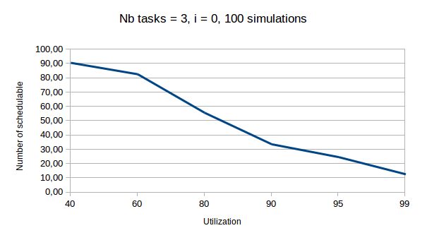
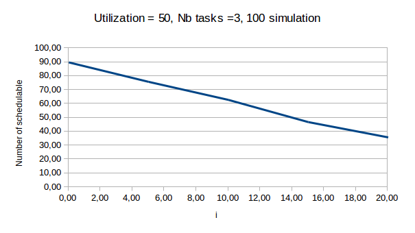
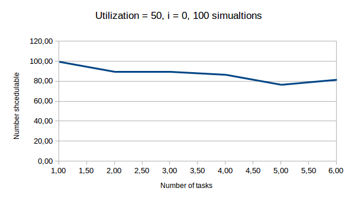
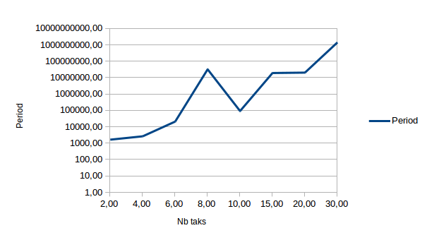
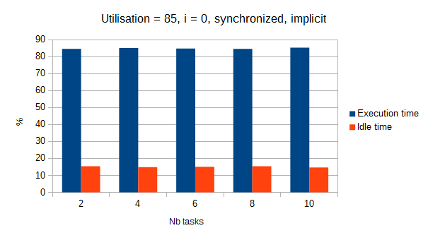
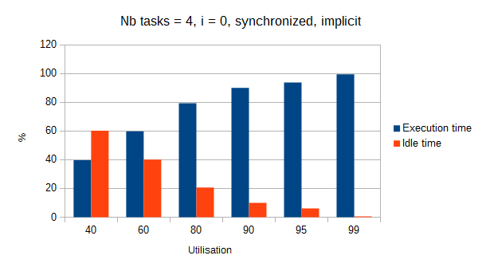
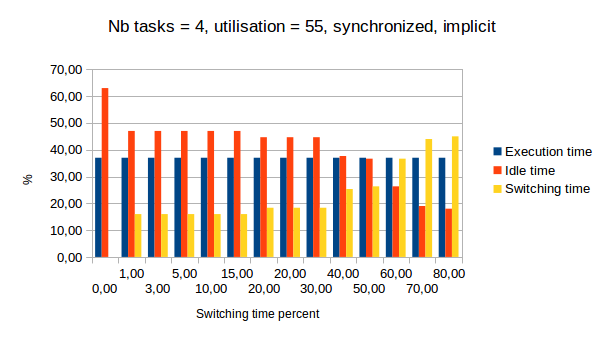
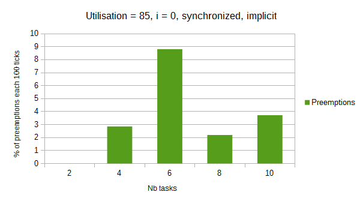
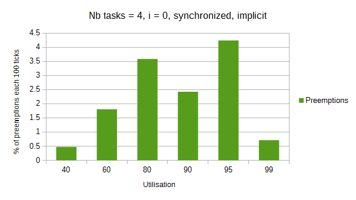
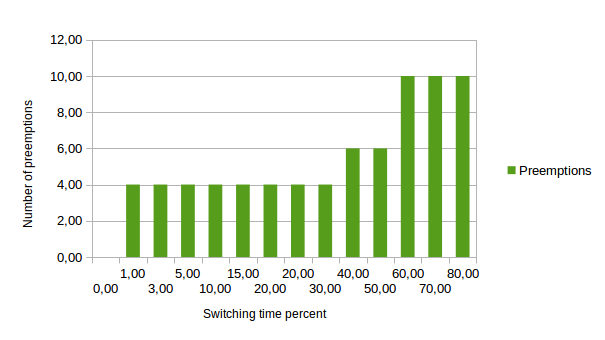

# edf-multiprocessor-simulation

```
git clone git@github.com:simonpicard/edf-multiprocessor-simulation.git
cd edf-multiprocessor-simulation
make
cd dist
./EDF_study
```

## Introduction

The purpose of the project is to implement an EDF scheduler which is a
scheduler for multiprocessor operating system.  
Three sub project were required, a tasks generator, the scheduler and a
program that compare the result of the scheduler with different tasks
propriety.

## Implementation

#### Tasks generator

The first step is to divide the total utilization of the system by the
number of tasks but some it is more interesting if the tasks do not have
the same utilization so a normal distribution is used where the average
is the total utilization divided by the number of process but it is not
guaranteed that the sum of the utilization will be the total so some
adjustment are then done.  
Once the utilization for a task is set, the period is randomly generated
between two values, the computing time of the tasks is the utilization
percent times the period.  
The deadline is a random number between the computing time and the
period.  
The offset is a random number between two given values.  
Once all the tasks are generated some additional adjustment are done to
be as close as possible to the utilization required.  
Finally, the generated tasks are written in a file where each line
describes one task and contains: Offset Period Deadline WCET.  
Here is the options for the generator :

    -o arg
        set the output file path
    -u arg
        set the utilization of the resulting system
    -n arg
        set the number of tasks
    -p arg | default = 1
        set the floor for the period (this number wil be multiplicated by "Pfactor")
    -P arg | default = 20
        set the roof for the period (this number wil be multiplicated by "Pfactor")
    -x arg | default = 10
        set the roof for the "Pfactor"
    -f arg | default = 0
        set the floor for the offset
    -F arg | default = 10
        set the roof for the offset
    -s
        generated a synchronous system, i.e no offset
    -i
        generated implicit deadline, i.e deadline = period

#### EDF simulator

The simulator begin by parsing the given tasks file description and
create a Tasks object with the properties of the tasks.  
The task object has a getNextJob function which returns the next jobs of
the periodic task. The simulator generate the first job of each tasks
then the simulator calculate the period of the system in order to
simulated a full period system, this period is obtained by calculating
the hyper period which is the least common multiple between all the
tasks, increased by the biggest offset of the tasks.  
Once the period is obtained, the simulator goes in loop which simulate
one tick of the system, this loop is repeated for all the period. The
simulator works with a list of job, one per tasks, first the simulator
verify if any job are done, if it is, this job is discarded and the next
job of the job’s task is added to the list, then the release time of the
jobs are set to the current system ticks if it is older. The jobs are
then sorted by their release time and if some of them are equals, the
one with the earliest deadline is placed before. The simulator verify
that the deadline of the first job (and only this one because it is the
one with the earliest) is exceed, if yes the tasks are not schedulable
and the simulator stops else the simulator verify that it can execute a
tick of the first job, if the release time of the first job is smaller
of equal to the current system tick. If it is, the simulator verify it
must calculate a switching time or a loading time and add it if it must,
then execute a tick of the job and do this loop again.  
Once all step are done, the simulator output the total period, the
execution ticks, the idle ticks, the switching ticks and the number of
preemptions.

#### EDF study

This part of the project is quite simple in its implementation, it has
one main function genRun which given the properties for the tasks
generation and the simulation will do both and return the output of the
simulator.

## Difficulties meet

The generation of the tasks was a bit complicated because the
utilization must be as close as possible but the utilization of each
tasks must not be the same so the solution was to use a uniform
distribution and then adjust the total utilization, the adjustment will
always output an utilization a bit lower than the required rather than a
bigger one.  
Another issue is that the system can have a really big period, so the
period of the tasks are meant to be rather small and multiple of 10.  
Finally, during the test I noticed that the tasks would often be not
schedulable I therefore set the implicit option in place because it is
not about a to big utilization but sometimes the jobs would just not
possible to complete two would be released at the same time and have
small deadline.

## Comparison tests

There is several tests, the way they are done is explained in the
Implementation section.  
The first test is a schedulability test, with different utilization,
number of tasks and switching time it is resulting which system is
schedulable, this test id done with the default option.  
The second one is the link between the period of the system and the
number of tasks.  
And three last are comparing all the outputs of the scheduler by varying
the number of tasks, the utilization and the switching time.  
The program create a file res.txt, in order to see the diagrams, the
user must copy the content, open the file diagram.ods with Libre Office
and past it in the top left cell of the file then hit the OK button in
the dialogue, the diagrams are now updated with the new data.

## Study

#### Schedulability

following different values for the utilization, the number of tasks and
the switching time percent, the test simulate a hundred randomly
generated system and give the number of schedulable one. See the figure
down below for the result when varying the utilization.  

<div class="center">

<figure>

<figcaption aria-hidden="true">Schedulability over the utilization</figcaption>
</figure>

</div>


It is clear that the more the utilization, the less the schedulabilty,
the explaination is quite simple, the more utilisation the longer the
utlisation of the tasks and therefore the bigger the chance to misse a
deadline.

<div class="center">

<figure>

<figcaption aria-hidden="true">Schedulability over the switching percent</figcaption>
</figure>

</div>


It appears that a big switching percent is the cause for a system to
fail, the switching percent lead to the loss of some ticks and so a
bigger probability for a job to miss it deadline.

<div class="center">

<figure>

<figcaption aria-hidden="true">Schedulability over the number of tasks</figcaption>
</figure>

</div>


The result is ambiguous, id there a lot a tasks the jobs will have a
small utilisation, they will be loaded and executed rather fast so less
chance of preemptions and missing the deadlines, but the more the tasks,
the more the chance for two jobs with small deadlines to be realease at
the same and miss their deadlines. These two effect are antagonist.

#### Period

The period depends on two factor, the offset and the period, it is the
least common multiple of all the period plus the biggest offset, so it
is LCM(P)+max(o) which is in O(LCM(P)), see the next figure for a
graphic of the period in function of the number of tasks.  

<div class="center">

<figure>

<figcaption aria-hidden="true">Period</figcaption>
</figure>

</div>


As expected, the period rise extremely fast following the number of
tasks.

#### Remark

For this test and all the following, the generated tasks systems are
synchronized and with implicit deadlines. Synchronized to have correct
executing and idle time, otherwise all the first part of the system
where all offset are not complete, the utilization of the system is not
the one required. Implicit because, as we saw on the schedulability
test, lots of system would fail just because the deadline are to small,
it is almost impossible to complete a 99% utilization system with
deadlines that are not implicit.

#### Utilization

The two first test are pretty obvious, it can be noticed that the number
of tasks does not affect the utilization and that the execution time and
the idle time are complementary.

<div class="center">

 

</div>


Now with the same tasks system, this test compare the utilization with
different switching time :

<div class="center">

<figure>

<figcaption aria-hidden="true">Utilization over switching time</figcaption>
</figure>

</div>


Firstly, the test has some plateau, this come from the rounding of
switching time and from the small size of the number of computing ticks
from the job. The execution time always takes the same part of the
simulation, what change is idle time and switching. For 60% of switching
time and over, the system is not schedulable, this fail can be explained
by two reasons, either there would more than 100% of the total
utilization of the system, that the idle could not compensate the
switching time, or that the switching time of a job will make it miss it
deadline even though there is still some idle time.

#### Preemption

<div class="center">

 

</div>


These tests do not make anything appear, there is apparently no
correlation between the utilization or the number of tasks and the
number of preemption.

<div class="center">

<figure>

<figcaption aria-hidden="true">Preemptions</figcaption>
</figure>

</div>


Here, it is noticeable that the more the switching time the more
preemption, this makes sense because after some switching a new job with
an earlier deadline might be added to the jobs.
